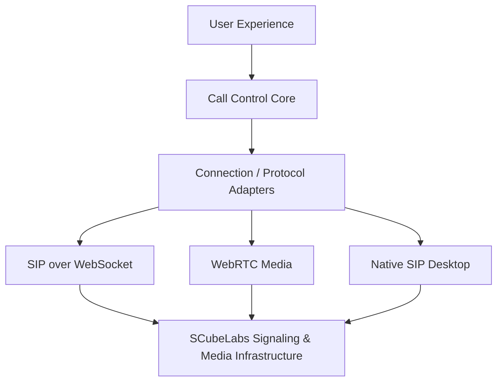

# VoxOne Showcase

> **SCubeLabs ecosystem** · [Platform](https://github.com/scubelabs/scubelabs) · [Architecture](https://github.com/scubelabs/ccaas-reference-architecture) · [Domain Model](https://github.com/scubelabs/ccaas-domain-model) · [Mini ACD](https://github.com/scubelabs/carrier-grade-mini-acd) · [SIP Lab](https://github.com/scubelabs/sip-troubleshooting-lab) · [VoxOne](https://github.com/scubelabs/voxone-showcase)

> **Role:** agent voice endpoint · **Maturity:** architecture/showcase · **Evidence:** public model and boundaries; implementation evidence evolves separately

### The Agent Voice Endpoint for the SCubeLabs Platform

**VoxOne** is the endpoint layer for the SCubeLabs voice experience: a cross-platform direction for browser-based WebRTC calling and an installable desktop softphone while keeping provider- and protocol-specific behavior outside the UI.

This public repository documents the product architecture, interaction model, call-control boundaries, demonstrations, and engineering evidence. The implementation remains separated from the showcase surface.

## Role in the SCubeLabs platform

VoxOne is the **agent-side voice endpoint**, not the owner of interaction routing or platform business state. It consumes authenticated offers/call-control intent from the agent and realtime domains, translates canonical call operations through protocol adapters, and establishes the endpoint signaling/media required for the agent experience.

**Upstream:** Agent Platform, Realtime Gateway, identity/session context.  
**Owns:** endpoint call-control model, device/connection state, endpoint media state and protocol adaptation.  
**Integrates with:** Voice Edge, Media Platform, recording/media policy and diagnostics.

## Architectural direction

The React/UI layer should operate on canonical call concepts rather than SIP-specific transactions or provider APIs.

## Canonical call model

`CallSession` · `CallLeg` · `EndpointIdentity` · `Connection` · `MediaSession` · `Device` · `CallState` · `CallEvent` · `Account` · `Registration`

## Engineering goals

- One coherent call-control model across browser and desktop.
- Protocol/provider behavior isolated behind adapters.
- Explicit call and media state transitions.
- Diagnostic visibility suitable for serious telephony troubleshooting.
- Clean integration with SCubeLabs agent, realtime, voice-edge and media domains.
- Evidence-driven interoperability and failure testing.

## Evidence and maturity

| Dimension | Current state |
|---|---|
| Product boundary | Defined |
| Canonical call model | Defined at showcase level |
| Browser adapter | Target capability; evidence tracked with implementation |
| Desktop native SIP | Target capability; evidence tracked with implementation |
| Interoperability | Must be demonstrated before compatibility claims |
| Failure/load evidence | Not yet claimed |
| Production evidence | Not claimed |

The showcase deliberately separates **what VoxOne is designed to become** from **what has been demonstrated**.
